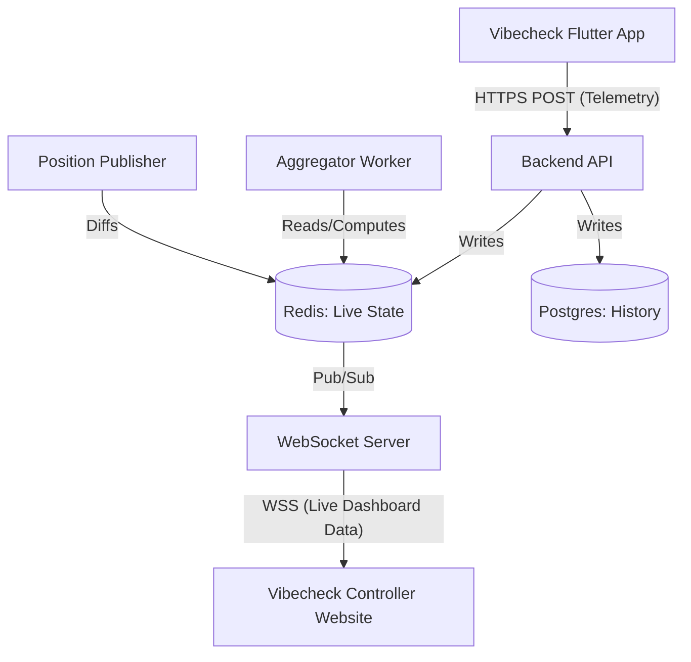

# Vibecheck Controller: Website Backend Integration Guide

This document outlines how the **Vibecheck Controller** (the web dashboard) integrates with the unified live backend. 

Vibecheck (the Flutter app) and Vibecheck Controller (the website) share the same backend. The app pushes telemetry, the backend aggregates it using Redis, and then the backend pushes the aggregated metrics and coordinates to the website via WebSockets.

---

## 1. Architecture Overview



**What the website receives over WebSocket:**
1. **Aggregated Zone Data:** Zone counts, density, flow, risk levels, and predicted congestion (every 1-2 seconds).
2. **Individual Positions:** Anonymous live phone coordinates (every 1 second), gated by staff authorization.

---

## 2. API & WebSocket Contract for the Website

### A. Authentication (HTTP)
Before connecting to the WebSocket, the dashboard must authenticate as a staff member/organizer to get a session token.

**POST `/api/v1/admin/login`**
- **Request:** `{ "username": "staff", "password": "***" }`
- **Response:** `{ "admin_token": "ey...", "event_id": "evt_123" }`

### B. Live Data Stream (WebSocket)
**Connection:** `wss://<API_BASE_URL>/ws/v1/admin/events/{event_id}/stream?token=<admin_token>`

Once connected, the server pushes JSON messages. The website listens to the `type` field to route the data.

#### Message 1: Zone Metrics Update
Pushed every 1-2 seconds by the Aggregator.
```json
{
  "type": "ZONE_METRICS_UPDATE",
  "timestamp": "2026-01-01T19:00:00Z",
  "zones": [
    {
      "zone_id": "zone_a",
      "occupancy": 450,
      "fill_percentage": 0.85,
      "risk_level": "HIGH",
      "flow_rate_per_min": 12,
      "predicted_congestion_in_15m": "CRITICAL"
    }
  ]
}
```

#### Message 2: Live Map Positions
Pushed every 1 second by the Position Publisher. Includes only users who are actively sharing location.
```json
{
  "type": "MAP_POSITIONS_UPDATE",
  "timestamp": "2026-01-01T19:00:01Z",
  "positions": [
    {
      "participant_id": "part_987",
      "lat": 34.0522,
      "lng": -118.2437,
      "zone_id": "zone_a",
      "heading_deg": 45.0,
      "speed_mps": 1.2
    }
  ]
}
```

---

## 3. Implementation Code (React / Next.js)

Here is a drop-in React hook and component setup to connect the Vibecheck Controller website to the backend.

### A. The WebSocket Hook (`useLiveDashboard.js`)

```javascript
import { useState, useEffect, useRef } from 'react';

export function useLiveDashboard(eventId, adminToken) {
  const [zoneMetrics, setZoneMetrics] = useState([]);
  const [livePositions, setLivePositions] = useState([]);
  const [isConnected, setIsConnected] = useState(false);
  const wsRef = useRef(null);

  useEffect(() => {
    if (!eventId || !adminToken) return;

    const wsUrl = `wss://api.vibecheck.com/ws/v1/admin/events/${eventId}/stream?token=${adminToken}`;
    const ws = new WebSocket(wsUrl);
    wsRef.current = ws;

    ws.onopen = () => setIsConnected(true);
    ws.onclose = () => setIsConnected(false);

    ws.onmessage = (event) => {
      const data = JSON.parse(event.data);

      switch (data.type) {
        case 'ZONE_METRICS_UPDATE':
          setZoneMetrics(data.zones);
          break;
        case 'MAP_POSITIONS_UPDATE':
          // Optional: You can merge with existing positions or do a full replace
          setLivePositions(data.positions);
          break;
        case 'HEARTBEAT':
          // Respond to keep connection alive if required by your load balancer
          ws.send(JSON.stringify({ type: 'HEARTBEAT_ACK' }));
          break;
        default:
          console.warn('Unknown message type:', data.type);
      }
    };

    return () => {
      ws.close();
    };
  }, [eventId, adminToken]);

  return { isConnected, zoneMetrics, livePositions };
}
```

### B. Dashboard Component (`LiveDashboard.jsx`)

```javascript
import React from 'react';
import { useLiveDashboard } from './useLiveDashboard';
// import { LiveMap } from './LiveMap'; // Your map component (e.g. Mapbox, Leaflet)

export default function LiveDashboard({ eventId, adminToken }) {
  const { isConnected, zoneMetrics, livePositions } = useLiveDashboard(eventId, adminToken);

  return (
    <div className="dashboard-container">
      <header>
        <h1>Vibecheck Controller</h1>
        <span className={isConnected ? "status green" : "status red"}>
          {isConnected ? "Live" : "Disconnected"}
        </span>
      </header>

      <div className="grid">
        {/* Left Column: Metrics */}
        <div className="metrics-panel">
          <h2>Zone Metrics</h2>
          {zoneMetrics.map(zone => (
            <div key={zone.zone_id} className={`card ${zone.risk_level.toLowerCase()}`}>
              <h3>{zone.zone_id}</h3>
              <p>Occupancy: {zone.occupancy} ({(zone.fill_percentage * 100).toFixed(0)}%)</p>
              <p>Risk: {zone.risk_level}</p>
              <p>Congestion in 15m: {zone.predicted_congestion_in_15m}</p>
            </div>
          ))}
        </div>

        {/* Right Column: Live Map */}
        <div className="map-panel">
          <h2>Live Attendee Map</h2>
          <p>Total active users tracked: {livePositions.length}</p>
          {/* Pass the positions into your Map renderer */}
          {/* <LiveMap markers={livePositions} zones={zoneMetrics} /> */}
        </div>
      </div>
    </div>
  );
}
```

## 4. Key Rules to Remember
1. **Never mutate data on the website.** The website is strictly a "dumb client" that reflects the backend's computations. All heavy lifting (risk algorithms, flow calculations) is done by the backend Aggregator.
2. **Reconnection Logic.** Ensure your WebSocket client implements exponential backoff for reconnects (omitted in the basic hook above for brevity) to handle network blips.
3. **Data Throttling.** If `MAP_POSITIONS_UPDATE` (1 per second) becomes too heavy for browser rendering engines (Mapbox/Deck.gl), use `requestAnimationFrame` on the frontend to smoothly interpolate marker movements instead of strictly snapping them to the coordinates every second.

